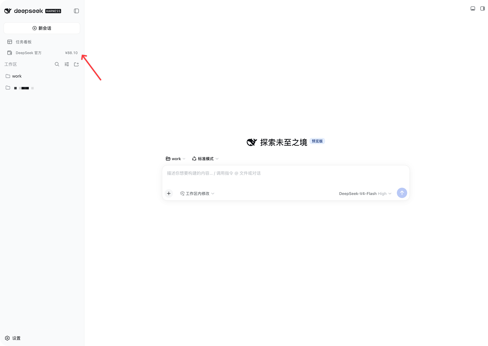
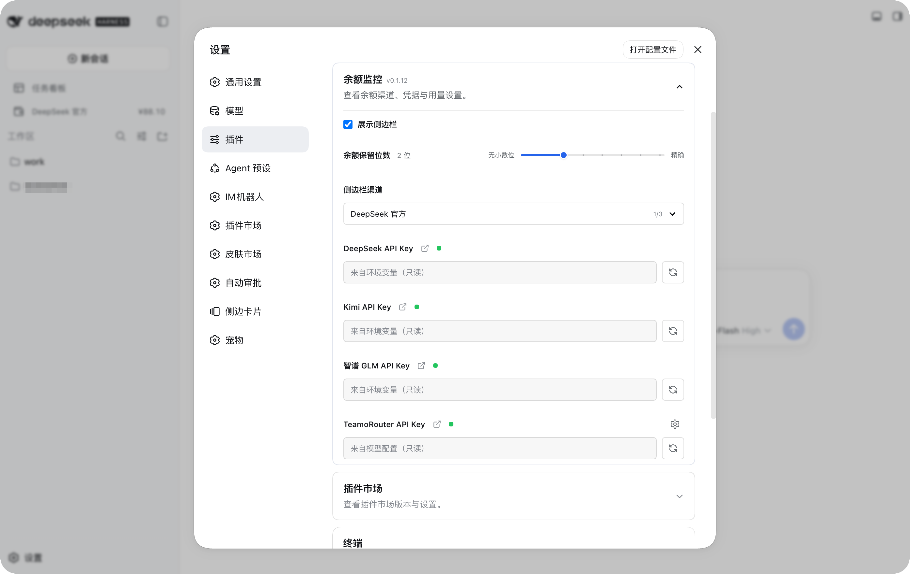

# dsh-balance-monitor

<div align="center">
  <strong>在 DSH Web 侧边栏中查看多渠道余额与用量</strong>
  <br /><br />
  <a href="https://www.npmjs.com/package/%40shawnkung%2Fdsh-balance-monitor"></a>
  <a href="https://github.com/ShawnKung/dsh-balance-monitor/actions/workflows/ci.yml"></a>
  <a href="https://github.com/ShawnKung/dsh-balance-monitor/stargazers"></a>
  <a href="https://opensource.org/licenses/MIT"></a>
  <br /><br />
  <a href="https://www.npmjs.com/package/@deepseek-ai/dsh?activeTab=versions"></a>
  
  
  
  
</div>

## 界面预览

### 侧边栏余额

<p align="center">
  
</p>

### 插件设置

<p align="center">
  
</p>

## 功能

- 在“新会话”和工作区之间展示所选渠道的余额，不干扰任务看板等其他侧边栏插件。
- 点击侧边栏入口查看所有渠道的余额，及支持渠道的消费、请求数和 Token 用量。
- 支持单渠道刷新与全量刷新，并通过颜色渐变反馈刷新结果。
- 会话结束后，根据当前模型 provider 的实际 API 域名定向刷新对应渠道。
- 支持浅色、深色和跟随系统主题。
- 在插件设置中选择侧边栏展示渠道、配置凭据引用和 TeamoRouter 查询范围。
- 启动时检查 npm 新版本，并可在插件内完成精确版本更新。

## 支持渠道

| 渠道 | 余额 | 每日/区间消费 | Token 用量 | 自动刷新识别 |
| --- | --- | --- | --- | --- |
| DeepSeek 官方 API | 是 | 否 | 否 | `deepseek.com` |
| Kimi 官方 API | 是 | 否 | 否 | `moonshot.cn` |
| 智谱 GLM | 是 | 否 | 否 | `bigmodel.cn` |
| TeamoRouter | 是 | 是 | 是 | `teamorouter.cn` |

未知域名、缺失 provider 或无效 URL 不会触发兜底全量刷新。

## 安装

前置条件：

- 已安装 DSH，且 `dsh web` 可以正常运行。
- Node.js 20 或更高版本。

### 从 npm 安装

```bash
dsh plugin --profile web add @shawnkung/dsh-balance-monitor@latest
dsh plugin --profile web list
```

安装后先在列表中确认实际版本，再重启 DSH Web 进程并硬刷新浏览器（macOS：`Cmd+Shift+R`；Windows/Linux：`Ctrl+Shift+R`）。

### 从源码安装

```bash
git clone https://github.com/ShawnKung/dsh-balance-monitor.git
cd dsh-balance-monitor
npm ci
npm run build
npm run check
npm test
dsh plugin --profile web add link:"$(pwd)"
```

仓库提交并发布预构建的 `client.js`，安装过程不会运行构建脚本。`link:` 会让 DSH Profile 直接引用当前目录；首次安装以及每次修改 `src/client.js` 后都应显式执行 `npm run build`。修改 Host 代码后还需要重启 DSH Web。

### 更新

```bash
dsh plugin --profile web add @shawnkung/dsh-balance-monitor@latest
dsh plugin --profile web list
```

## 配置

进入 DSH 的“设置 → 插件 → DSH Balance Monitor”：

- **侧边栏展示渠道**：可多选，最多展示 3 个渠道。
- **余额保留位数**：通过滑块统一控制侧边栏、弹窗余额明细和消费金额的显示精度，默认保留 2 位，可选无小数位、1 至 6 位或精确。
- **DeepSeek API Key**：默认凭据引用为 `DEEPSEEK_API_KEY`。
- **Kimi API Key**：默认凭据引用为 `KIMI_API_KEY`，调用 CN Host `https://api.moonshot.cn/v1/users/me/balance`。
- **智谱 GLM API Key**：默认凭据引用为 `ZAI_API_KEY`，通过智谱官方域名的账户接口查询按量余额。
- **TeamoRouter API Key**：默认凭据引用为 `TEAMO_API_KEY`。
- **统计天数**：TeamoRouter 区间统计范围，支持 2 至 90 天。

API Key 通过 DSH credentials 服务解析和写入，明文不会发送到浏览器。凭据优先级为环境变量、模型 Provider 配置、用户配置；模型凭据按 provider 的实际 API 域名匹配，并通过 `apiKeyEnv` 凭据引用复用。只有插件请求端点仍属于同一受支持渠道域名时才会复用；若同一渠道存在多个不同的 Provider 凭据，插件不会擅自选择。

## 自动刷新

插件启动时会刷新全部可解析到凭据的渠道。此后：

- 点击顶部刷新按钮：刷新全部渠道。
- 点击渠道刷新按钮：只刷新该渠道。
- 会话回合结束：读取 Session 中的 provider，通过 DSH provider 目录找到对应 `baseURL`，再按 hostname 匹配渠道。
- provider 未命中已支持域名：不刷新。

Host 快照带有单调递增的 revision，前端会拒绝迟到的旧快照，避免启动阶段的 `loading` 覆盖已完成结果。

## 插件更新

插件启动时及之后每 10 分钟会由 Host 异步检查 npm `latest` 版本，不阻塞 DSH 运行。更新状态由 Host 中的全局单例维护，余额弹窗和设置页只通过 HTTP/SSE 读取同一状态；任一入口点击后，两处会同步展示更新进度。Host 使用固定包名和 Registry 返回的精确 SemVer 调用当前 DSH CLI，安装结果会再次从 profile 校验，成功后显示“重启后生效”，但不会自动重启 DSH。

本地 `link:`、`file:`、Git 和 workspace 安装不会被自动替换，也不会显示 Registry 更新入口。

## 兼容性

- Node.js：`>=20`。
- DSH：`>=0.1.2-rc.1 <0.2.0`。
- Profile：仅支持 `web`。
- 已验证版本：`0.1.2-rc.1`、`0.1.5-rc.1`。其他版本只有完成一次性 Profile 的安装、配置加载、Web 冷启动和卸载验证后，才会在 manifest 中标记为兼容。

## 运行边界

### 生命周期与依赖

包不包含 `preinstall`、`install`、`postinstall` 或 `prepare` 脚本。构建只在开发者显式运行 `npm run build`、CI 执行 `npm run ci`，以及 npm 发布前执行 `prepublishOnly` 时发生。

运行时依赖及用途：

- `@deepseek-ai/schemastery`：声明 DSH 插件配置 Schema。
- `semver`：比较已安装版本与 npm Registry 返回的版本。
- SortableJS 已打包进 `client.js`，仅作为开发依赖参与前端构建，不会作为独立运行时依赖安装。

### 权限与外部服务

| 能力 | 使用范围 |
| --- | --- |
| 网络 | 请求 DeepSeek、Kimi、智谱和 TeamoRouter 的余额或用量接口；请求 `registry.npmjs.org` 检查插件更新。 |
| 凭据 | 仅通过 DSH `credentials` 服务解析、写入或移除插件声明的 API Key 引用；Key 不发送到浏览器。 |
| 文件 | 仅读取 `~/.dsh/profiles/web/package.json` 和当前插件的 `package.json`，用于确认安装来源与版本。 |
| 命令 | 仅在用户点击插件更新后，通过当前 Node.js 进程调用当前 DSH CLI，执行固定包名和精确版本的 `plugin --profile web add`。 |
| 浏览器接口 | 仅接受 loopback 且同源的 HTTP/SSE 请求，用于 Host 与插件前端同步状态。 |

外部渠道请求彼此隔离；单个渠道失败不会阻塞其他渠道，并会保留上次成功结果。更新检查或安装失败不会修改当前运行版本；更新成功后也不会自动重启 DSH。未识别的 provider 不会触发兜底刷新。

## 安全设计

- API Key 只存在于 DSH credentials 服务和 Host 请求链路。
- 自动复用模型 Key 时只读取 provider 的凭据引用，并调用 `ctx.credentials.resolve()`；插件不直接读取环境变量或凭据文件。
- 浏览器只接收凭据是否已配置、来源和是否可写等元数据。
- 自动更新只接受固定 npm 包名与合法的更高 SemVer，不执行浏览器提供的包名、版本或 Shell 命令。
- HTTP 与 SSE 接口仅接受 loopback 且同源的请求。
- provider 识别使用 `URL.hostname` 做精确域名或子域名匹配，不使用字符串包含判断。
- npm 发布内容由 `package.json#files` 白名单控制，并在 CI 中执行 tarball 审计。

安全问题请参阅 [SECURITY.md](./SECURITY.md)。

## 开发

```bash
npm ci
npm run check
npm test
npm run build
```

完整检查：

```bash
npm run ci
npm pack --dry-run
```

提交信息必须遵循 [Conventional Commits](https://www.conventionalcommits.org/zh-hans/v1.0.0/)：

```text
feat: add a new balance channel
fix: prevent stale snapshots from replacing fresh data
docs: clarify local installation
```

详细流程见 [CONTRIBUTING.md](./CONTRIBUTING.md)。

## 发布

1. 更新 `package.json` 和 `CHANGELOG.md` 中的版本。
2. 合并通过 CI 的 Conventional Commit。
3. 创建并推送格式为 `vX.Y.Z` 的 Tag。
4. `release.yml` 校验 Tag 与包版本一致后，通过 npm Trusted Publishing 自动发布，并创建 GitHub Release。

## 许可证

[MIT](./LICENSE) © ShawnKung
